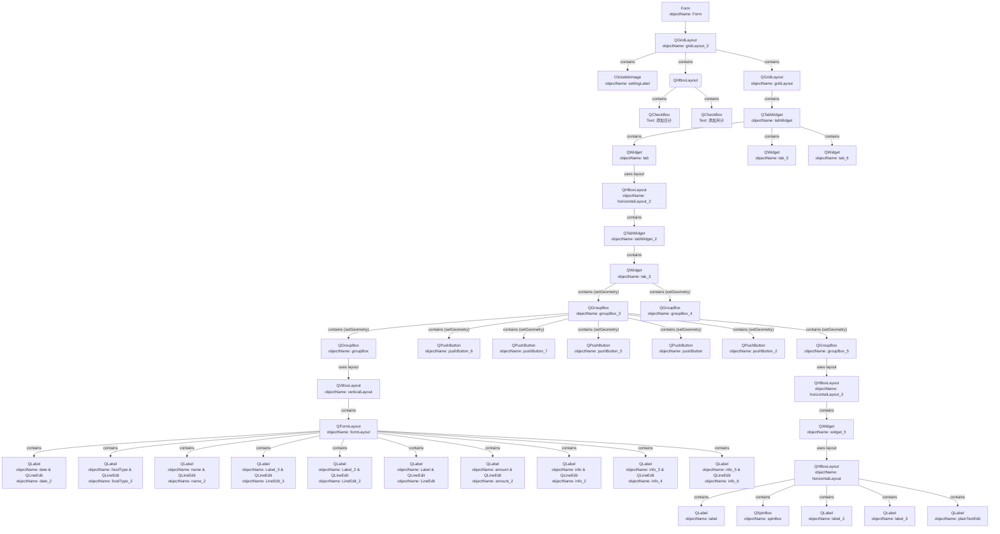

```mermaid
graph TD
    Form[Form<br>objectName: Form] --> gridLayout_3[QGridLayout<br>objectName: gridLayout_3];

    gridLayout_3 -- contains --> setting[ClickableImage<br>objectName: settingLabel];
    gridLayout_3 -- contains --> checkbox_layout(QHBoxLayout);
    checkbox_layout -- contains --> checkbox1[QCheckBox<br>Text: 添加日计];
    checkbox_layout -- contains --> checkbox2[QCheckBox<br>Text: 添加月计];
    gridLayout_3 -- contains --> gridLayout[QGridLayout<br>objectName: gridLayout];

    gridLayout -- contains --> tabWidget[QTabWidget<br>objectName: tabWidget];

    tabWidget -- contains --> tab[QWidget<br>objectName: tab];
    tabWidget -- contains --> tab_5[QWidget<br>objectName: tab_5];
    tabWidget -- contains --> tab_6[QWidget<br>objectName: tab_6];

    tab -- uses layout --> horizontalLayout_2[QHBoxLayout<br>objectName: horizontalLayout_2];
    horizontalLayout_2 -- contains --> tabWidget_2[QTabWidget<br>objectName: tabWidget_2];

    tabWidget_2 -- contains --> tab_3[QWidget<br>objectName: tab_3];

    %% 注意：tab_3 内的这些控件是使用 setGeometry 定位的，而不是布局管理器
    tab_3 -- contains (setGeometry) --> groupBox_3[QGroupBox<br>objectName: groupBox_3];
    tab_3 -- contains (setGeometry) --> groupBox_4[QGroupBox<br>objectName: groupBox_4];

    %% 注意：groupBox_3 内的这些控件是使用 setGeometry 定位的
    groupBox_3 -- contains (setGeometry) --> groupBox[QGroupBox<br>objectName: groupBox];
    groupBox_3 -- contains (setGeometry) --> pushButton_6[QPushButton<br>objectName: pushButton_6];
    groupBox_3 -- contains (setGeometry) --> pushButton_7[QPushButton<br>objectName: pushButton_7];
    groupBox_3 -- contains (setGeometry) --> pushButton_5[QPushButton<br>objectName: pushButton_5];
    groupBox_3 -- contains (setGeometry) --> pushButton[QPushButton<br>objectName: pushButton];
    groupBox_3 -- contains (setGeometry) --> pushButton_2[QPushButton<br>objectName: pushButton_2];
    groupBox_3 -- contains (setGeometry) --> groupBox_5[QGroupBox<br>objectName: groupBox_5];

    groupBox -- uses layout --> verticalLayout[QVBoxLayout<br>objectName: verticalLayout];
    verticalLayout -- contains --> formLayout[QFormLayout<br>objectName: formLayout];

    %% Form Layout 中的标签和输入框对，包含 ObjectName
    formLayout -- contains --> Date_Pair[QLabel<br>objectName: date & QLineEdit<br>objectName: date_2];
    formLayout -- contains --> Category_Pair[QLabel<br>objectName: foodType & QLineEdit<br>objectName: foodType_2];
    formLayout -- contains --> Name_Pair[QLabel<br>objectName: name & QLineEdit<br>objectName: name_2];
    formLayout -- contains --> Unit_Pair[QLabel<br>objectName: Label_3 & QLineEdit<br>objectName: LineEdit_3];
    formLayout -- contains --> Price_Pair[QLabel<br>objectName: Label_2 & QLineEdit<br>objectName: LineEdit_2];
    formLayout -- contains --> Quantity_Pair[QLabel<br>objectName: Label & QLineEdit<br>objectName: LineEdit];
    formLayout -- contains --> Amount_Pair[QLabel<br>objectName: amount & QLineEdit<br>objectName: amount_2];
    formLayout -- contains --> Info_Pair[QLabel<br>objectName: info & QLineEdit<br>objectName: info_2];
    formLayout -- contains --> Company_Pair[QLabel<br>objectName: info_3 & QLineEdit<br>objectName: info_4];
    formLayout -- contains --> Type_Pair[QLabel<br>objectName: info_5 & QLineEdit<br>objectName: info_6];


    groupBox_5 -- uses layout --> horizontalLayout_3[QHBoxLayout<br>objectName: horizontalLayout_3];
    horizontalLayout_3 -- contains --> widget_5[QWidget<br>objectName: widget_5];

    widget_5 -- uses layout --> horizontalLayout[QHBoxLayout<br>objectName: horizontalLayout];
    horizontalLayout -- contains --> label[QLabel<br>objectName: label];
    horizontalLayout -- contains --> spinBox[QSpinBox<br>objectName: spinBox];
    horizontalLayout -- contains --> label_2[QLabel<br>objectName: label_2];
    horizontalLayout -- contains --> label_3[QLabel<br>objectName: label_3];
    horizontalLayout -- contains --> storageNum[QLabel<br>objectName: plainTextEdit]; 

```

主界面 Mermaid DOM图
